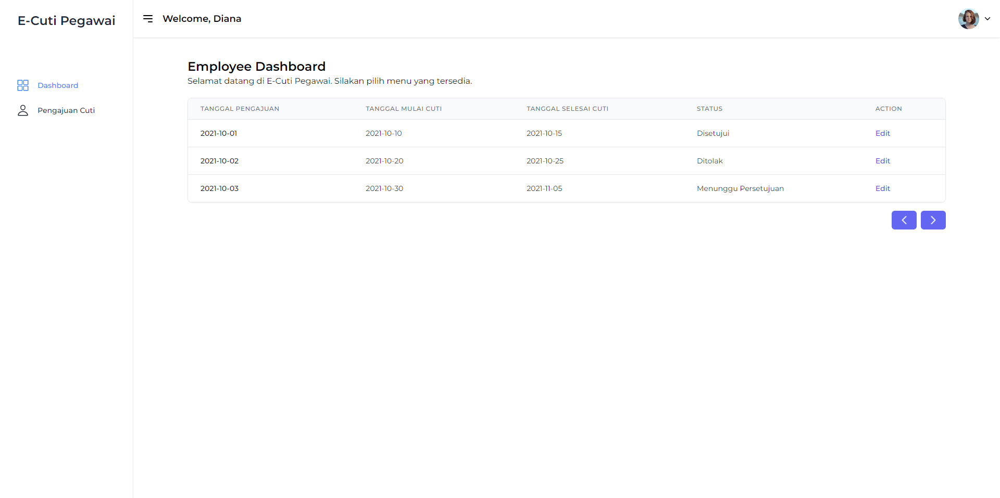
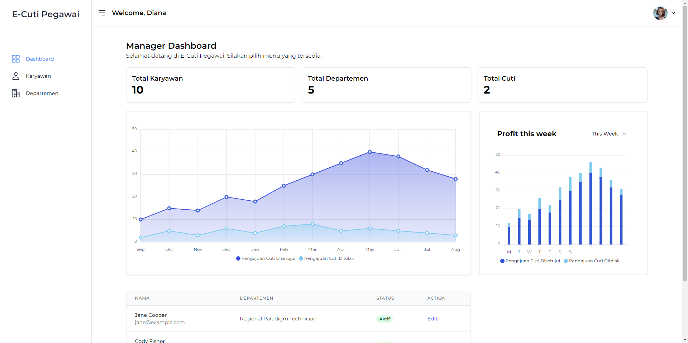

# Aplikasi Web E-Cuti (Frontend)

Aplikasi Web E-Cuti (Frontend) aplikasi web yang dibangun menggunakan Vue.js untuk mengelola data karyawan dan cuti karyawan. Aplikasi ini memungkinkan pengguna untuk menambah, melihat, dan mengelola informasi terkait karyawan dan departemen mereka.

## Screenshot Aplikasi  




## Fitur

- Menambah, mengedit, dan menghapus karyawan.
- Menambah, mengedit, dan menghapus departemen.
- Melihat daftar karyawan dan departemen.
- Pencarian karyawan berdasarkan nama.
- Pagination untuk tabel karyawan dan departemen.

## Teknologi

- [Vue.js](https://vuejs.org/)
- [Vite](https://vitejs.dev/)
- [Tailwind CSS](https://tailwindcss.com/)
- [Ionicons](https://ionicons.com/)

## Instalasi

1. Clone repositori ini:

git clone https://github.com/callmeeve/e-cuti.git

2. Masuk ke direktori proyek:

```bash
cd e-cuti
```

3. Install dependencies:

```bash
npm install
```

4. Jalankan server pengembangan:

```bash
npm run dev
```

5. Buka browser dan akses `http://localhost:5173`.

## Tailwind CSS

Proyek ini menggunakan Tailwind CSS untuk styling. Konfigurasi Tailwind terdapat di `tailwind.config.js`.

## Kontribusi

Jika Anda ingin berkontribusi pada proyek ini, silakan buat pull request atau buka issue untuk diskusi lebih lanjut.
